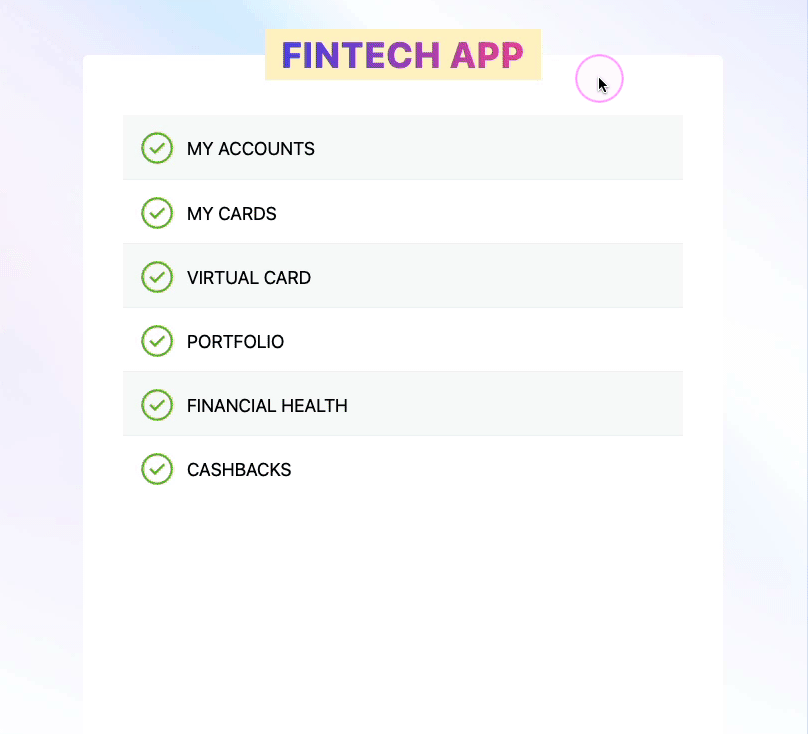

# ▲ &nbsp; Fintech kata

 &nbsp; 

> A kata project to explore and learn Clean Architecture in React.  
> _(The implementation is done via Test-driven Development)_

### Business requirements
Enable the customer to create virtual credit card.

Business requirements are documented in [#1][1].

### Explore the codebase

- Explore the initial/empty state of the project setup is within the [`main`][2] branch.
- The final state of the codebase (with feature [#1][1] implemented) is in the [`feat/create-virtual-card`][3] branch.
- To explore step by step implementation, review [commits][4] bottom up.

### Demo

  
_(animated gif showing the outcome of the project)_

[1]: https://github.com/niksumeiko/virtual-credit-card/issues/1
[2]: https://github.com/niksumeiko/virtual-credit-card/tree/main
[3]: https://github.com/niksumeiko/virtual-credit-card/tree/feat/create-virtual-card
[4]: https://github.com/niksumeiko/virtual-credit-card/commits/feat/create-virtual-card
